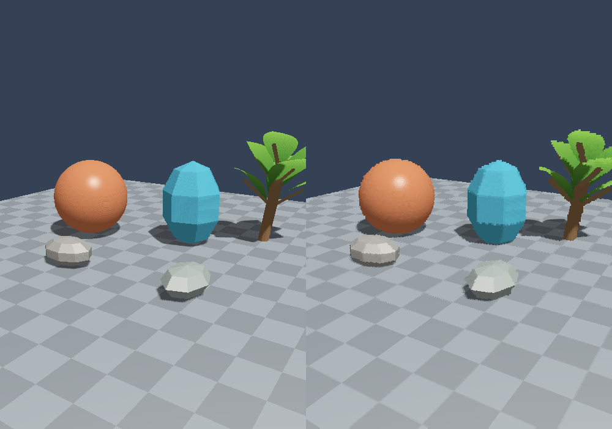

# Microvoxels

A small C++20/Vulkan rendering experiment: the source visibility pass identifies ordinary triangles,
then **triangle–cell overlap** generates a sparse shell of **unlit coloured cubes**. Colours are evaluated
on the original source surfaces. The earlier pixel-sampled path remains available for comparison.

The world is triangles. There is no voxel terrain, stored object volume, or persistent voxel world.
The default cube fragment shader is literally `outColor = color;`. Cube lighting has a separate,
explicitly selected debug pipeline.



## Build and run

Requires CMake 3.24+, a C++20 compiler, Vulkan headers/loader, `glslangValidator`, GLFW 3.3+, and GLM.
No ray-tracing hardware or vendor-specific extensions are required. Vulkan 1.1 graphics + compute,
an sRGB desktop swapchain, and the image formats checked at startup are used.

Ubuntu / Debian:

```sh
sudo apt-get install cmake ninja-build g++ libvulkan-dev libglfw3-dev libglm-dev glslang-tools
cmake -S . -B build -G Ninja -DCMAKE_BUILD_TYPE=Release
cmake --build build
./build/microvoxels
```

Install a current AMD Vulkan driver on your own machine. On Linux this is commonly Mesa RADV;
on Windows use the AMD driver and the [Vulkan SDK](https://vulkan.lunarg.com/sdk/home).

Windows, Visual Studio 2022 + vcpkg + Vulkan SDK:

```powershell
vcpkg install glfw3:x64-windows glm:x64-windows
cmake -S . -B build -A x64 -DCMAKE_TOOLCHAIN_FILE=C:/vcpkg/scripts/buildsystems/vcpkg.cmake
cmake --build build --config Release
.\build\Release\microvoxels.exe
```

CI compiles the Windows version with MSVC and checks Vulkan rendering on Linux with a software driver.
Shaders are compiled automatically and loaded from the build's shader directory. Build locally before running.

## Try the experiment

Start in side-by-side mode. The orange sphere uses interpolated smooth normals and a glossy source highlight.
The blue crystal uses flat source normals. The tree and its curved leaves bend continuously in the shared
source animation pass. Watch the leaves while changing voxel size: their occupied world cells pop in and out.

Click the HUD's buttons and sliders, or use these keys:

| Control | Action |
|---|---|
| WASD / Q / E | Fly forward/backward/sideways/down/up |
| Hold right mouse | Look around |
| R | Reset the camera to the starting view and unfreeze/resample the cloud |
| T | Toggle geometric triangle occupancy / pixel-sampled occupancy |
| C | In the pixel-sampled path, toggle LOD based on source sample spacing |
| Shift | Faster camera |
| Tab | Source → microvoxels → side by side |
| F | Freeze/unfreeze the generated cloud; camera and source animation continue |
| G | Compare with separately lit cube faces |
| + / - | Increase/decrease the base voxel size |
| [ / ] | Decrease/increase the first LOD distance |
| 1–6 | Number of nested LOD levels |
| O | Average RGB / closest source sample |
| X | Toggle 2×2 source sampling; each image dimension is capped at 2048 |
| H | Albedo only / smooth lighting / smooth lighting with source shadow map |
| P | Pause source animation |
| F1 | Hide/show the HUD |
| Escape | Exit |

Freeze, then walk around a sphere or plant. Triangles never selected by source visibility are missing by design. The frozen colours
also retain their original view-dependent source shading, including the captured glossy highlight.
Use the left pane to see the current continuous scene while the right pane displays that frozen shell.

Defaults: base size 10 mm; first LOD boundary 4 m; five levels; ±10% hysteresis; 1.03× cube size.
The default triangle path uses the depth-tested source triangle IDs only to select triangles. It then tests
those triangles against geometric world-grid cells, independently of source pixel sample placement. A
conservative region-frustum test skips work entirely outside the view. Static triangle occupancy is stable
while it remains selected at the same LOD; true visibility, animation and LOD changes still update the shell.

Colour is evaluated at the closest point on each intersecting source triangle to the cell centre, using the
same interpolated normals, albedo, gloss and shadow function as the source view. Average mode weights triangle
contributions equally; closest mode picks the nearest source point to the camera. Final cubes remain unlit.

Press `T` or pass `--sample-occupancy` for the earlier pixel-sampled provider. In that path, adaptive LOD is
enabled by default: it raises a region's level when samples are too far apart for smaller cells. `C` toggles
that behaviour. Additional source samples (`X`) can reveal tiny triangles in both paths, but geometric
occupancy itself no longer needs denser pixel samples to cover an already-selected triangle.
The grid origin stays at world `(0,0,0)` through camera movement. The slight cube enlargement helps coverage;
set `Settings::splat` to `1.0` for exact cell-sized cubes. Geometric coverage can generate substantially more
cells than pixel sampling; the HUD reports capacity drops. Coarser base cells or earlier distance LOD reduce
that work.

If both panes are empty and the HUD reports `HITS 0`, press `R` to restore the starting view. Mouse look
rebases on capture, stops on focus loss, and ignores cursor warps; profile reports include the camera pose
to help distinguish lost source visibility from a voxel draw failure.

## Pipeline

1. **SourceWorld** makes 2,860 ordinary triangles: ground, sphere, crystal, rocks, trunk, branches, leaves.
2. **SourceRenderer** animates a shared GPU vertex buffer once, then draws a shadow map and depth-tested
   G-buffer of triangle IDs, world positions and already-shaded linear RGB.
3. **VisualVoxelizer** marks visible triangle IDs, selects hysteretic LOD for world regions, enumerates
   intersecting triangle–AABB cells, shades source surface points, deduplicates exact keys and compacts the
   occupied cells into GPU instances and a GPU-written indirect draw command.
4. **VoxelRenderer** depth-tests those instances and writes their stored colours. All faces of one normal
   voxel have identical RGB. Source comparison, debug cube lighting, and HUD are separate draw pipelines.

`TriangleSurfaces` is the triangle-specific source contract. The alternative `SurfaceSamples` contract
retains the pixel position/RGB provider, so a future triangle ray-query renderer, SDF, or parametric source
can supply samples without a triangle-overlap stage. Hardware ray queries and acceleration structures are
not implemented in this version.

Read [the implementation notes](docs/IMPLEMENTATION.md) for exact key handling, LOD history, synchronization,
capacity limits, and known artefacts. Read [the measured profile](docs/PROFILING.md) for results and next steps.

## Verification and profiling

```sh
ctest --test-dir build --output-on-failure
./build/microvoxels --validation --verify --exercise --frames 8 --width 480 --height 360
./build/microvoxels --validation --verify --exercise-controls --frames 16 --width 480 --height 360
./build/microvoxels --validation --exercise-stability --frames 6 --width 480 --height 360
./build/microvoxels --frames 120 --width 1100 --height 720 --no-ui --report profile.json
./build/microvoxels --frames 1 --time 1.2 --screenshot comparison.ppm
```

`--validation` requires `VK_LAYER_KHRONOS_validation`. `--verify` performs expensive readbacks and CPU
reference checks, including independent polygon clipping for triangle occupancy and source-surface RGB; leave it off when measuring interactive performance. `--exercise` freezes the cloud,
moves the camera, checks byte-identical instances/counters, unfreezes, and exercises closest RGB and debug
cube lighting. `--exercise-controls` checks mouse capture/focus, looking away, freezing an empty cloud,
camera reset, setting changes, sample-target recreation, and window resize. `--exercise-stability` regenerates
the cloud while changing camera position/orientation, source sampling density and window size, then checks
that a static floor patch retains identical cell keys and albedo colours. `--hidden` hides a GLFW window;
it still needs a display. In CI, use `xvfb-run -a`.

JSON reports contain source triangle count, sampling resolution, visible hits, unique voxels, per-LOD counts,
dropped samples, validation errors, and per-stage Vulkan timestamp durations after two warm-up frames.
Timings are unavailable if the queue has no timestamp support. HUD statistics describe the previous completed
frame; while frozen, hit/voxel counters describe the last cloud generation.

This version is opaque only. Reflections, transparent source layers, hardware ray tracing, temporal colour
accumulation, and more sophisticated hole filling are intentionally left for later experiments.
