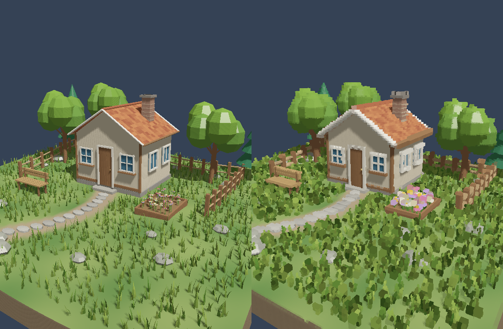

# Microvoxels

A C++20/Vulkan experiment that turns **rasterized visible world positions and final source RGB** into a sparse shell of **unlit coloured cubes**. The voxel generator reads source buffers only. It has no source triangle topology, material evaluation, or post-process raycasting.

The default source scene is a 38,425-triangle countryside garden: rolling terrain, grass blades, a tiled-roof cottage, opaque windows, a stone path, trees, a timber fence, a flower bed and a bench. The original 2,860-triangle test scene remains available with `--scene test`. A future SDF, procedural renderer or hardware ray tracer can supply the same visible XYZ + final RGB contract. The normal cube fragment shader is literally `outColor = color;`.



Default-scene preview rendered with software Vulkan for visual verification. Hardware performance must be measured on the device running the demo.

## Build and run

Requires CMake 3.24+, a C++20 compiler, Vulkan headers/loader, `glslangValidator`, GLFW 3.3+ and GLM. The demo uses Vulkan 1.1 graphics and compute. No ray-tracing extensions are required.

Ubuntu / Debian:

```sh
sudo apt-get install cmake ninja-build g++ libvulkan-dev libglfw3-dev libglm-dev glslang-tools
cmake -S . -B build -G Ninja -DCMAKE_BUILD_TYPE=Release
cmake --build build
./build/microvoxels
```

Windows, Visual Studio + vcpkg + Vulkan SDK:

```bat
C:\Users\Extreme\vcpkg\vcpkg.exe install glfw3:x64-windows glm:x64-windows
cmake -S . -B build-windows -A x64 -DCMAKE_TOOLCHAIN_FILE=C:/Users/Extreme/vcpkg/scripts/buildsystems/vcpkg.cmake
cmake --build build-windows --config Release
.\build-windows\Release\microvoxels.exe
```

Run commands from the project directory containing `CMakeLists.txt`. Shader compilation is automatic. An existing configured build only needs `cmake --build build-windows --config Release` after updating the source. CI builds with Windows MSVC and verifies rendering with software Vulkan on Linux.

Select a source scene; both use the same restored voxel pipeline and settings:

```bat
.\build-windows\Release\microvoxels.exe --scene garden
.\build-windows\Release\microvoxels.exe --scene test
```

The garden is generated once from a fixed seed. All terrain, roof tiles, grass, flowers and props are ordinary source triangles; no scene mesh data is supplied to the voxel filter. **R** restores the selected scene's starting view. Source grass bending reuses the existing vertex animation. No additional passes, voxel lighting or rendering optimizations are introduced.

## Compare point and footprint splats

The default **footprint mode** estimates a small parallelogram from the centre pixel and its four immediate axis neighbors, all within a 3×3 neighborhood. It rejects discontinuous neighbors, clamps the patch, and emits cells overlapped by it. Every contribution uses the centre sample's already-shaded RGB. The original point cell is always retained.

Press **T** to compare this with **point mode**, where one valid source sample emits one cell. Both use the same source visibility, world grid, RGB reduction and unlit cube renderer. Default bounds are a **one-cell radius** and **27 candidate writes per valid source sample**. The bounds can be configured independently:

```bat
.\build-windows\Release\microvoxels.exe --point-splats
.\build-windows\Release\microvoxels.exe --footprint-radius 2 --footprint-limit 27
.\build-windows\Release\microvoxels.exe --levels 1 --no-adaptive-lod
```

`--footprint-radius 0` produces point-sized footprints. `--sample-occupancy` remains an alias for point mode. Normal cubes use exact cell-sized geometry. Shared corners come from integer grid boundaries. Ordered GPU compaction also fixes the observed stationary draw-order flicker at equal-depth faces.

| Control | Action |
|---|---|
| WASD / Q / E | Fly |
| Hold right mouse | Look around |
| R | Reset the camera and unfreeze |
| T | Point / conservative footprint splats |
| C | Toggle projected-source-footprint LOD |
| Shift | Faster camera |
| Tab | Source / microvoxels / side by side |
| F | Freeze the cloud; camera and source continue |
| G | Separate cube-face-lighting debug pipeline |
| I | Toggle indexed cube vertices; the frozen cloud is unchanged |
| B | Toggle safe hardware backface culling |
| + / - | Base voxel size |
| [ / ] | First distance LOD boundary |
| 1–6 | Number of nested LOD levels |
| O | Average RGB / closest source point |
| X | Toggle 2×2 source sampling |
| H | Albedo / source lighting / source shadows |
| P | Pause source animation |
| F1 | Hide/show HUD |
| Escape | Exit |

Defaults: 10 mm base pitch, 4 m first distance boundary, five levels, ±10% LOD hysteresis, footprint splats and projected-size LOD enabled. Grid origin stays at world `(0,0,0)`.

The HUD shows source resolution/samples, valid hits, candidate writes, unique cubes, writes per hit, maximum footprint extent/count, clamped/rejected footprints, frame time, generation time and cube draw time.

Freeze and move around to inspect the sampled shell. Newly exposed surfaces are absent until regeneration. Stored RGB retains its original view-dependent source shading. If both panes are empty with `HITS 0`, press **R**. Mouse capture/focus and finite camera-pose guards remain in place.

## Pipeline

1. **SourceRenderer** renders opaque visibility, depth, cached world XYZ and final shaded RGB.
2. **SurfaceSamples** exposes only visible world positions and final RGB, with one previous position image for LOD history.
3. **VisualVoxelizer** selects world-region LOD, estimates bounded screen-derived footprints, quantizes cells and reduces RGB using exact keys.
4. GPU count/prefix/compact passes emit instances in hash-slot order and write the indirect draw count.
5. **VoxelRenderer** draws centre/size + RGBA instances with stored RGB directly.

The cube renderer now has independently switchable indexed geometry and hardware
backface culling. The original draw remains the default. Indexed, unculled cubes
share eight corners; culled cubes share four corners per face and preserve exit
faces at the near plane. See [the hardware draw experiments](docs/GPU_RENDERING.md)
for a repeatable Windows benchmark and correctness checks. No voxel-generation
passes, source visibility or RGB semantics change.

The existing XYZ buffer is reused rather than adding depth reconstruction to normal generation. Verification independently reconstructs positions from actual Vulkan depth and inverse VP. All lighting, normals, shadows, materials and tone mapping remain in the source stage. There are no ray–box tests, second source visibility pass, triangle–cell voxelization or persistent voxel volume.

## Verification and measurements

```sh
ctest --test-dir build --output-on-failure
./build/microvoxels --scene garden --validation --verify --exercise --frames 8 --width 480 --height 360
./build/microvoxels --scene test --validation --verify --exercise-controls --frames 16 --width 480 --height 360
./build/microvoxels --scene test --validation --exercise-stability --frames 12 --width 640 --height 480 --capture-sequence captures/motion
./build/microvoxels --frames 120 --time 1 --no-ui --report profile.json
```

`--verify` checks every GPU cell, LOD, RGB reduction, indirect command, footprint limit/counter, and cached XYZ against source depth. Footprint occupancy uses independent double-precision polygon clipping on the CPU. Verification and screenshots add readbacks; leave them off for performance measurements.

`--exercise` checks byte-identical frozen buffers across camera motion, then average/closest RGB and cube-light debug. `--exercise-controls` checks camera loss/reset, mouse capture/focus, empty freeze recovery, settings, mode switches and resize. `--exercise-stability` uses three stationary frames followed by nine small camera movements, with fixed source time, albedo lighting and one LOD. It verifies identical stationary cell/RGB sets and records turnover in a static floor patch. `tests/footprint_comparison.py` checks exact stationary RGB screenshots and measures matched motion silhouettes/coverage.

Source sampling is capped at 2048 pixels per dimension. Tables are bounded; the HUD reports drops. Very fine cells, grazing angles, silhouettes, discontinuity fallback and footprint caps can still leave gaps or changing cells. Projected-size LOD is useful when source pixels cover many smaller cells.

Read [the implementation notes](docs/IMPLEMENTATION.md) and [the measured comparison](docs/FOOTPRINTS.md). Opaque geometry only; transparency and temporal occupancy accumulation are not implemented.

Existing measurement documents refer to the original `--scene test` fixture. Software Vulkan is used for CI correctness and preview rendering; it does not establish performance on a hardware GPU.
