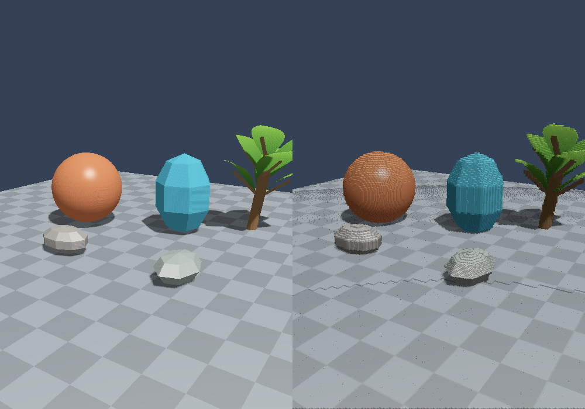

# Measured profile and verification

This run used **software Vulkan**, not the user's AMD GPU. The available device was
`llvmpipe (LLVM 20.1.2, 256 bits)`, Mesa 25.2.8, on Linux. These are Vulkan timestamp
intervals on that software driver. They establish a working pipeline and a local bottleneck;
they do not predict RX 6700 performance.

## Baseline

1000 × 700 source samples and output; side-by-side view; fixed animation time 1.2 seconds;
10 mm base cells; five LOD levels; 4 m first boundary; average RGB; source shadows enabled;
normal unlit cube pipeline; no HUD or verification readbacks. Twelve frames, first two excluded
from timing averages. Validation enabled, zero errors.

| Measurement | Result |
|---|---:|
| Source triangles | 2,860 |
| Source samples/frame | 700,000 |
| Visible surface hits | 415,571 |
| Unique visual voxels | 77,652 |
| LOD 0 / 1 / 2 / 3 / 4 counts | 0 / 38,438 / 37,983 / 1,231 / 0 |
| Dropped surface hits | 0 |
| Dropped history samples | 0 |

| Stage | Mean timestamp interval |
|---|---:|
| Source shading and shadow map | 11.251 ms |
| History / table clears / LOD | 30.980 ms |
| Cell hash and RGB reduction | 5.933 ms |
| Instance compaction | 0.203 ms |
| Source comparison + cube drawing | 106.411 ms |

Generation total: **37.115 ms**. Final rendering is the bottleneck in this environment,
at **106.411 ms**. That interval includes the inexpensive source comparison pane
and drawing 77,652 cubes, or 2,795,472 procedurally generated cube vertices. Compaction is small;
clears and per-sample history/LOD work dominate the measured generation stages.
The empty HUD interval still contains a timestamp/command boundary and is not useful UI work.

## Checks completed

- Release C++20 build and all 14 shader compilations passed.
- Every shader passed `spirv-val --target-env vulkan1.1`.
- Lattice tests passed for negative coordinates, parent/child alignment, hit containment,
  hysteresis bands, and multi-level camera jumps.
- Six generated frames at 1000 × 700 matched an independent CPU reference for every occupied cell,
  LOD, sample reduction, stored RGB, unique count, and per-LOD counters.
- The eight-frame exercise checked five generated frames, three frozen frames including camera
  motion, unfreezing, closest-sample colour, and the separate cube-lighting pipeline.
- Three supersampled frames at 320 × 240 output / 640 × 480 source also matched the CPU reference.
- All executed validation runs reported zero Vulkan errors.
- Matched fixed-time normal/debug screenshots had **byte-identical source halves**. Only the
  cube half changed, becoming visibly rougher when face lighting was enabled.

Reports in this folder are the actual JSON outputs. The exercise report mixes several camera/settings
states by design and is a correctness record, not a controlled performance comparison.
Windows and physical AMD hardware were not available for this run.

## What to optimize next

1. On the AMD card, collect a longer report with verification/HUD off. Use the measured stage
   proportions to choose the next change; software rasterization can exaggerate draw cost.
2. If cube rendering dominates there too, use a shared indexed cube with eight vertices in the unlit
   pipeline and cull consistently wound back faces. The current 36-vertex implementation is easy to
   inspect but repeats vertex work and submits every face.
3. If generation dominates, aggregate repeated tile-local cell/root hits before global atomics,
   track touched slots rather than clearing/scanning every slot, and retain a compact active list.
   Preserve exact keys and compare every change against the existing CPU reference.
4. Once GPU stage costs are under control, use more frames in flight and delayed statistic readbacks.
   The current one-frame implementation serializes CPU/GPU work and uses FIFO presentation.
5. Improve coverage with conservative samples or carefully bounded temporal occupancy. Keep it a
   visible shell and retain intentional popping rather than constructing full object volumes.

## Does ray tracing help?

**Not measured in this milestone.** Only the raster source provider exists, so there is no honest
ray-query-versus-raster speedup number yet. The source scene has only 2,860 triangles and needs the
nearest opaque surface; raster sampling is the useful first baseline for this experiment.

A KHR ray-query provider is an appropriate next comparison when testing source-space shadows,
reflections, or multiple transparent layers. Keep the same sampling resolution, lighting features,
voxel settings, camera and animation time, and separately time source rendering and AS updates.
The voxel generation and drawing stages will receive the same provider contract either way;
ray tracing does not automatically reduce their costs. For bending plants, acceleration-structure
update cost must be included in that comparison.
